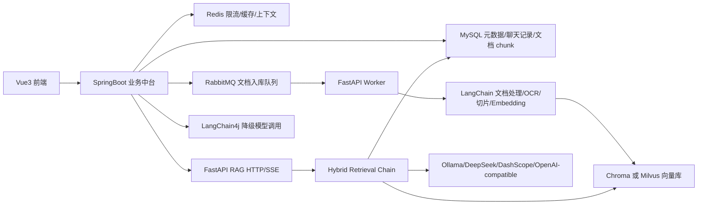

# 多租户企业私有知识库 RAG 中台

这是一个面向企业内部资料问答的私有知识库 RAG 项目，核心目标不是做一个简单聊天 demo，而是把“文档上传、异步入库、向量检索、关键词召回、答案生成、引用溯源、多租户隔离、权限控制、缓存限流、熔断降级、模型切换、容器化部署”串成一条完整工程链路。

在线访问地址：[http://agent.lovelywlzd.online/](http://agent.lovelywlzd.online/)

说明：小服务器仅测试使用，资源有限，首次访问或模型冷启动可能较慢，感谢理解。

## 技术栈

### 前端

- Vue 3 + Vite：实现单页管理台和开发环境热更新。
- Element Plus：表单、按钮、表格、上传、标签页等后台管理组件。
- Axios：统一封装 `/api/**` 请求，生产环境默认只访问 SpringBoot 网关入口。
- markdown-it + DOMPurify：渲染模型 Markdown 回答，并对 HTML 做安全净化。
- SSE：支持流式问答、模型 reasoning 事件和最终 done 事件。

### Java 业务中台

- Spring Boot 3：业务 API、配置管理和服务编排入口。
- SaToken：登录态、角色和权限校验。
- MyBatis-Plus + MySQL：租户、用户、知识库、文档元数据、聊天会话、模型配置等持久化。
- Flyway：数据库版本迁移，启动时自动执行 `V*.sql`。
- Redis：限流、FAQ 缓存和短期多轮上下文缓存。
- RabbitMQ：文档上传后异步投递入库任务，削峰并解耦 Java 与 Python。
- Resilience4j：包装 FastAPI RAG 调用，异常时触发熔断和降级。
- LangChain4j：FastAPI 不可用时，Java 侧直接调用模型给出降级回答。

### Python RAG 服务

- FastAPI + Pydantic：提供 RAG 查询、聊天、文档入库和健康检查接口。
- LangChain：负责文档加载、切片、Prompt、LLMChain、Embedding 和 VectorStore 适配。
- Chroma / Milvus：本地开发默认可用 Chroma，生产路径可切换 Milvus。
- MySQL FULLTEXT / LIKE：作为关键词召回和向量检索失败时的兜底。
- aio-pika：异步消费 RabbitMQ 文档入库任务。
- pandas / openpyxl / xlrd：处理 CSV、Excel 等表格类知识。
- PyPDF / PyMuPDF / python-docx / docx2txt：处理 PDF、Word 等常见办公文档。
- RapidOCR + OpenCV + Pillow：处理扫描 PDF、图片型 DOCX 等低文本层资料。
- Ollama / DeepSeek / DashScope / OpenAI-compatible：支持本地模型和云端兼容接口切换。

### 部署与运维

- Docker Compose：编排 MySQL、Redis、RabbitMQ、Milvus、SpringBoot、FastAPI、FastAPI worker 和前端。
- Nginx：前端容器提供静态资源，并代理 `/api` 到 SpringBoot。
- `.env.example`：统一维护数据库、MQ、向量库、模型和服务地址配置。

## 总体架构



系统分成三层：

1. 前端只面向用户交互，不直接绕过后端访问 FastAPI。
2. Java 负责企业业务边界，包括登录、租户、权限、限流、缓存、聊天记录、文档元数据和模型配置。
3. Python 负责 AI 能力，包括文档解析、OCR、切片、Embedding、向量库、混合检索、rerank、Prompt 和生成。

这种拆分的好处是：Java 保持企业应用常见的权限和数据治理能力，Python 保持 RAG 链路的快速迭代能力，二者通过 HTTP 和 RabbitMQ 解耦。

## 核心业务流程

### 文档上传与异步入库

1. 用户在前端选择租户、知识库并上传文件。
2. SpringBoot 校验登录态、租户成员关系和上传权限。
3. Java 保存文件和文档元数据，状态写为 `queued`。
4. Java 投递 RabbitMQ 消息到 `rag.document.ingest`。
5. FastAPI worker 异步消费任务，读取文件并解析文本。
6. LangChain 按文档结构进行清洗、切片和 metadata 生成。
7. Python 写入 MySQL chunk 表，并写入 Chroma/Milvus 向量库。
8. worker 回调 Java 内部接口，更新文档状态、chunk 数量和错误信息。

上传接口不做重计算，避免大文件导致 HTTP 超时；重活放到 worker 里，通过并发数、prefetch、重试次数和死信队列控制稳定性。

### 知识库问答

1. 前端调用 Java `/api/chat/ask` 或流式问答接口。
2. Java 校验 SaToken、`X-Tenant-Id`、知识库范围和用户权限。
3. Java 执行 Redis 限流、FAQ 缓存查询和聊天记录持久化。
4. Java 将问题、租户、知识库、模型参数和历史上下文转发给 FastAPI。
5. FastAPI 执行 query rewrite，把多轮指代问题改写成独立检索问题。
6. 检索链路同时做向量召回和关键词召回，并融合分数。
7. 命中 child chunk 后回表扩展 parent context，增强上下文完整度。
8. reranker 对候选证据重新排序，低于阈值的证据不进入回答。
9. LLM 基于证据、历史和运行时上下文生成答案。
10. 返回 answer、citations 和 trace，前端展示答案、来源文件、页码、分数和命中文本。

## RAG 检索设计

### 混合检索

单纯向量检索容易漏掉专有名词、编号、制度标题；单纯关键词检索又无法理解同义表达。因此系统采用：

- 向量检索：解决语义相似问题。
- MySQL FULLTEXT：解决关键词、编号、文件原文命中问题。
- LIKE fallback：FULLTEXT 无结果或不可用时兜底。
- 分数融合：按向量分、关键词分、跨通道命中、metadata 完整度加权。
- 多 query 扩展：原问题、改写问题和关键词候选共同召回。

### Parent-Child Chunk

文档入库时同时生成 parent chunk 和 child chunk：

- child chunk 更短，用于向量检索，命中更精准。
- parent chunk 更长，用于回答生成，保留上下文完整性。
- 命中 child 后，通过 parent_id 找回同一父块下的上下文。

这样可以减少“检索命中了半句话，但模型看不懂前后文”的问题。

### 引用溯源

每个 chunk 都保存：

- `tenant_id`
- `kb_id`
- `doc_id`
- `chunk_id`
- `file_name`
- `source_uri`
- `page`
- `section_title`
- `parent_id`

回答时返回 citations，前端可以展示来源文件、页码、相关度和命中文本，方便用户校验答案依据。

## 多租户与权限设计

- 前端请求携带 `Authorization` 和 `X-Tenant-Id`。
- Java `TenantInterceptor` 不直接相信 header，而是用当前登录用户和成员关系表二次校验。
- 业务表统一携带 `tenant_id`，按租户过滤。
- Python 入库和检索必须带 `tenantId + kbId`。
- 向量库 collection 使用租户和知识库生成隔离名称。
- 平台管理员、企业创建者、企业管理员、普通员工分层授权。

权限边界放在 Java 侧，FastAPI 只作为内部 RAG 能力服务，避免前端绕过认证、限流、缓存和审计。

## 稳定性设计

- RabbitMQ 异步入库：上传接口快速返回，解析和向量化由 worker 执行。
- 幂等入库：按 `tenantId + kbId + docId` 覆盖旧 chunk，避免重复消息产生重复向量。
- 死信队列：失败超过最大次数后进入 DLQ，避免异常文件无限重试。
- Redis 限流：按租户、用户和接口维度限制高频请求。
- FAQ 缓存：高频问答命中缓存，降低模型调用成本。
- Resilience4j 熔断：FastAPI 或向量库异常时快速失败。
- LangChain4j 降级：RAG 链路不可用时给出明确降级回答，不伪造引用。
- SSE 流式输出：前端可逐步接收模型输出和 reasoning 事件。

## 目录结构

```text
E:\AI
  SpringBoot/              Java 业务中台
  FastApi/                 Python RAG 服务和 worker
  frontend/                Vue3 前端
  docs/                    项目说明、交付说明、问题复盘
  scripts/                 本地辅助脚本
  docker-compose.yml       本地/测试环境容器编排
  .env.example             环境变量模板
  README.md                项目总说明
```

## 本地启动

### 前端

```powershell
cd E:\AI\frontend
npm install
npm run dev
```

默认访问 `http://localhost:5173`，Vite 会把 `/api` 代理到 `http://localhost:8080`。

### Java

```powershell
cd E:\AI\SpringBoot
mvn test
mvn package -DskipTests
```

### Python

```powershell
cd E:\AI\FastApi
python -m venv .venv
.\.venv\Scripts\Activate.ps1
pip install -r requirements.txt -r requirements.worker.txt
uvicorn app.main:app --reload --host 0.0.0.0 --port 8000
```

启动 worker：

```powershell
cd E:\AI\FastApi
python -m app.workers.rabbitmq_consumer
```

### Docker Compose

```powershell
cd E:\AI
Copy-Item .env.example .env
docker compose --profile app up -d --build
```

启动前请把 `.env` 里的 `change_me_*` 占位值替换为强密码或真实配置。

## 常用服务地址

- 本地前端开发：`http://localhost:5173`
- Compose 前端：`http://localhost:3000`
- SpringBoot：`http://localhost:8080`
- FastAPI：`http://127.0.0.1:8000`
- RabbitMQ 管理台：`http://localhost:15672`
- Milvus：`localhost:19530`
- 在线测试地址：[http://agent.lovelywlzd.online/](http://agent.lovelywlzd.online/)

## 验证命令

```powershell
cd E:\AI\SpringBoot
mvn test
mvn package -DskipTests

cd E:\AI\FastApi
python -m compileall app

cd E:\AI\frontend
npm run build

cd E:\AI
docker compose --profile app config
```
